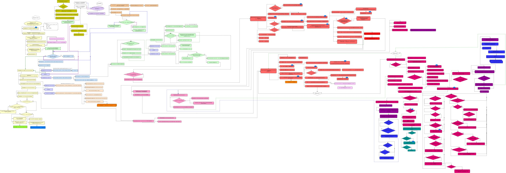

# Under the hood: React
<em> This repository contains an explanation of inner work of React. In fact, I was debugging through the entire code base and put all the logic on visual block-schemes, analyzed them, summarized and explained main concepts and approaches. I've already finished with Stack version and now I work with the next, Fiber version.  </em>

Each scheme is clickable and can be opened in a new tab, use that to zoom it and be able to read from it. Keep the article and a scheme you are reading about at that moment in separate windows (tabs), that will help to match text and code flow easier.

We are gonna talk here about both React versions, current one with Stack reconciler and the next one with Fiber (as you probably know, the next version of React will be released soon), so, you can understand better how current React works and appreciate huge achievements on React-Fiber.  

## Stack reconciler

